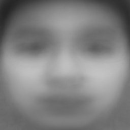

# eigenface
A python implementation of a classic algorithm eigenface for face recognition.

## Overview

数值方法课程 project：基于 PCA (Principal Component Analysis) 的特征脸识别算法。

人脸数据集来源于班级的所有同学，出于保护个人隐私的目的无法公开，代码因此无法正常运行。
可以修改 `eigenface.py` 和 `test_tset.py` 中的文件路径和图像名称，应用于新的人脸图像集。

原数据集测试的识别率在 60% ～ 70%。

平均脸 (average face)：

部分特征脸 (eigenface)：

## TODO

- [ ] 修改代码，应用于 Yale faces 等开源人脸数据库，测试结果

- [ ] 修改代码逻辑，完善代码功能，并对函数进行封装

## License

MIT
